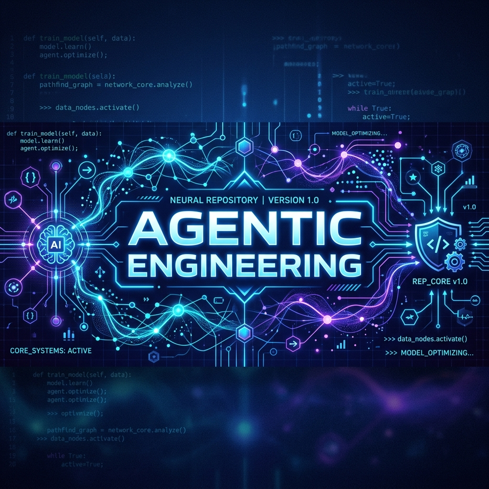
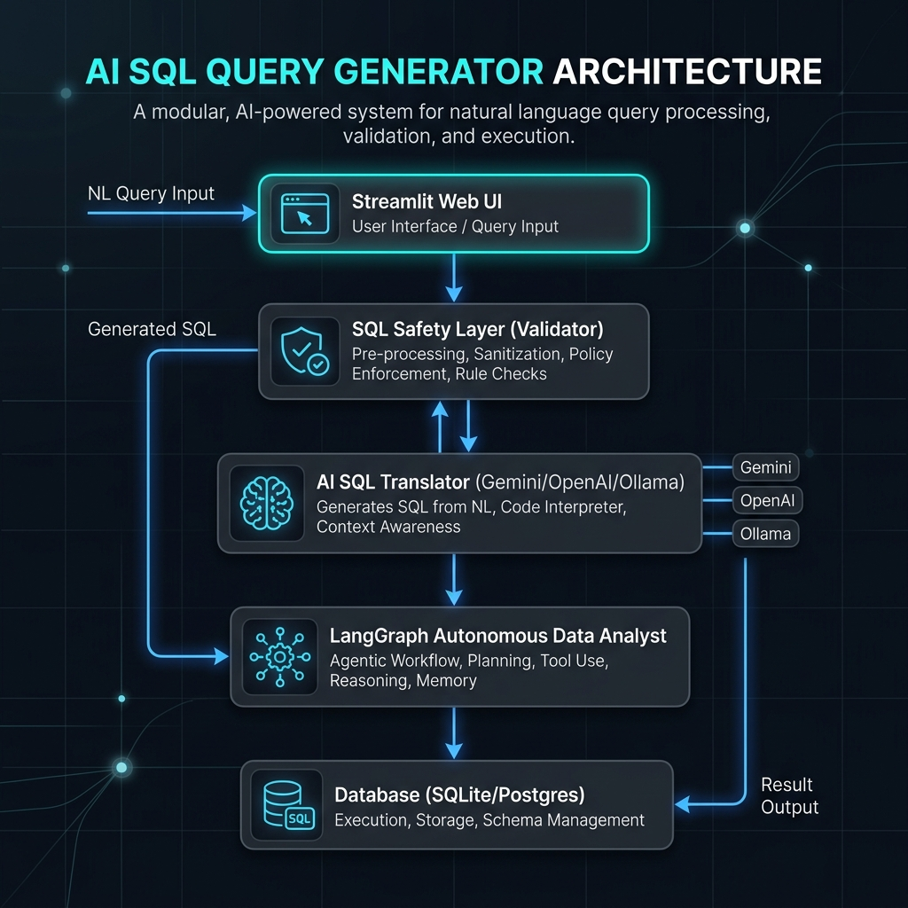

<p align="center">
  
</p>

# Production Agentic Engineering Handbook 🧠🤖

Welcome to the **Production Agentic Engineering Handbook** repository! This project compiles architectural blueprints, implementation schemas, and operational checklists designed to build, scale, and secure production-grade autonomous agents and multi-agent systems.

---

## 🏗️ System Blueprint Overview

A production-grade agent is more than an LLM prompt wrapper. It requires a robust, sandboxed feedback loop combining dynamic memory layers, strict validation guardrails, and deterministic state graphs:

<p align="center">
  
</p>

---

## 📘 Handbook Chapters

Explore the full, comprehensive implementation guide:

### 🔗 **[Read the Agentic Engineering Handbook ➡️](AGENTIC_ENGINEERING_GUIDE.md)**

Inside, you will find exhaustive analysis and architectural diagrams covering:

1.  **Core Agent Architecture & Memory Systems:** Working memory, semantic recall (RAG), and context window compression middleware (`TokenLimiter` and `ToolCallFilter`).
2.  **Tool Calling & Model Context Protocol (MCP):** Host-client integration layers, stdio/SSE protocol specifications, and strict schema validation patterns using Pydantic.
3.  **Deterministic Graph-Based Workflows:** Chaining, parallel branching, state merging, and suspend-and-resume orchestration loops.
4.  **Modern Retrieval-Augmented Generation (RAG):** Evaluated alternatives (Agentic RAG, ReAG, and Full Context Window loading) to optimize retrieval performance.
5.  **Multi-Agent Systems:** Team collaboration hierarchies (Supervisor Router models and Workflows-as-Tools).
6.  **Observability & Evaluations (Evals):** OpenTelemetry tracking, latency logging, and quantitative grading via LLM-as-a-Judge rubrics.
7.  **Sandboxing & Safe Deployments:** Guardrail modules, ephemeral execution runtimes (Docker/Firecracker), and durable execution engines.

---

## 🧪 Quick Reference: Pydantic Tool Schema Pattern

To build tools that LLMs call reliably, define inputs and operations with strict parameter validations:

```python
from pydantic import BaseModel, Field

class SchemaExtractionTool(BaseModel):
    """Dynamically extracts DB structures (tables, primary/foreign keys) for prompt context."""
    db_connection_string: str = Field(
        ..., 
        description="SQLAlchemy-compatible PostgreSQL or SQLite connection URI."
    )
```

---

## 📬 Let's Collaborate

If you are building production agents or optimizing vector retrieval platforms, let's connect!
*   💼 **LinkedIn:** [linkedin.com/in/srikanthkpk](https://www.linkedin.com/in/srikanthkpk/)
*   📧 **Email:** [srikanth.ln63@gmail.com](mailto:srikanth.ln63@gmail.com)
